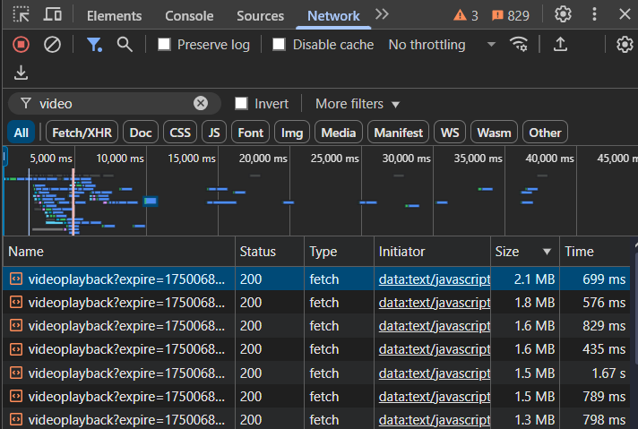
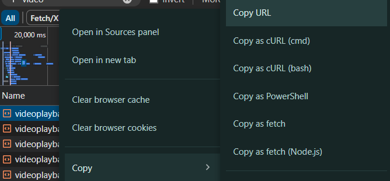
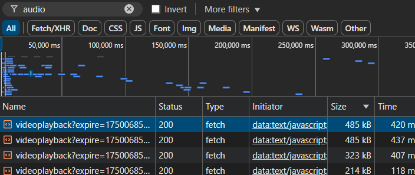

# GDrive View-Only Video Downloader⚡

A modern, elegant web application for cleaning Google Drive URLs to make them directly downloadable. Transform messy Google Drive sharing links into clean, downloadable URLs with just one click!

## ✨ Features

* 🎯 **One-Click Cleaning** \- Instantly clean Google Drive URLs
* 🎨 **Modern UI** \- Beautiful\, responsive design with smooth animations
* 🌙 **Dark/Light Mode** \- Toggle between themes with persistent storage
* 📱 **Mobile Friendly** \- Fully responsive design that works on all devices
* 🔗 **Dual Support** \- Handle both video and audio URLs simultaneously
* 📋 **Multiple Export Options** \- Copy to clipboard\, open in browser\, or download as text file
* ⚡ **Fast & Lightweight** \- Built with React and optimized for performance

## 🚀 Demo

[Live Demo Site](https://g-drive-link-cleaner.vercel.app/)

## 🛠️ How to Extract Google Drive URLs

### 🎥 For Video URLs

#### Step 1: Open the Video

1. Open the view-only video in a browser (e.g., Chrome)
2. Set the quality to highest and play it for a few seconds

#### Step 2: Open Developer Tools

1. Right-click → **Inspect** or press `Ctrl+Shift+I`
2. Go to the **Network** tab
3. Filter by `mime=video` (or just type `video` in the filter box)



#### Step 3: Find and Copy the URL

1. Sort by **Size (Descending)**
2. Look for a request with `mime=video/mp4`
3. Right-click → **Copy** → **Copy link address**



#### Step 4: Use URL Cleaner Pro

Paste the URL into the app and click "Clean URLs" - it will automatically:

* Remove `=1&srfvp=1` from the end
* Remove the `range=xxxx-yyyy&` parameter

* ✅ Result: A downloadable video file link which you can click on Open Video and Download directly.

### 🔊 For Audio URLs

#### Step 3: Filter for Audio

1. In the Network tab, type `audio` in the search bar
2. Find a request with `mime=audio/mp4`



#### Step 4: Use URL Cleaner Pro

The app will clean the audio URL by removing:

* `=1&srfvp=1`
* `range=xxxx-yyyy&`
* ✅ Result: A downloadable audio file link which you can click on Open Video and Download directly.

#### Step 5 : Add the Audio Track

Use a media player like VLC (on PC) or MX Player (on Android) that supports adding external audio tracks. Simply load the video and select the downloaded audio file as the secondary audio source — and you'll have your video with sound.

## 🏃‍♂️ Quick Start

### Prerequisites

* Node.js 16+
* npm or yarn

### Installation

1. **Clone the repository**

``` bash
git clone https://github.com/omeshapasan2/GDrive-Link-Cleaner.git
cd GDrive-Link-Cleaner
```

2. **Install dependencies**

``` bash
npm install
# or
yarn install
```

3. **Start the development server**

``` bash
npm run dev
# or
yarn start
```

4. **Open your browser**
Navigate to `http://localhost:5173`

## 🔧 Usage

1. **Extract URLs** following the guide above
2. **Paste URLs** into the Video URL and/or Audio URL fields
3. **Click "Clean URLs"** to process them
4. **Use the cleaned URLs** by:
    * 🌐 Open/Download the Files
    * 📋 Copying to clipboard
    * 💾 Downloading as TXT files

## 🏗️ Built With

* **React** \- Frontend framework
* **Tailwind CSS** \- Styling and responsive design
* **Lucide React** \- Beautiful icons
* **Modern CSS** \- Animations and transitions
* **Aceternity UI** \- For Dot Grid Background


## 🎨 Customization

### Theme Colors

The app uses a customizable color scheme. You can modify the theme in the `themeClasses` object:

``` javascript
const themeClasses = {
  cardBg: isDark ? 'bg-black' : 'bg-white',
  text: isDark ? 'text-white' : 'text-gray-900',
  // ... customize other theme properties
};
```

### Adding New URL Patterns

To support additional URL cleaning patterns, modify the `cleanUrl` function:

``` javascript
function cleanUrl(url) {
  // Add your custom cleaning logic here
  url = url.replace(/your-pattern-here/, "");
  return url;
}
```

## 🚀 Deployment

### Netlify

1. Build the project: `npm run build`
2. Deploy the `build` folder to Netlify
3. Configure redirects if needed

### Vercel

1. Connect your GitHub repository to Vercel
2. Deploy automatically on every push

### GitHub Pages

1. Install gh-pages: `npm install --save-dev gh-pages`
2. Add to package.json:

``` json
"homepage": "https://yourusername.github.io/url-cleaner-pro",
"scripts": {
  "predeploy": "npm run build",
  "deploy": "gh-pages -d build"
}
```

3. Deploy: `npm run deploy`

## 🤝 Contributing

Contributions are welcome! Please feel free to submit a Pull Request.

1. **Fork the repository**
2. **Create your feature branch** (`git checkout -b feature/AmazingFeature`)
3. **Commit your changes** (`git commit -m 'Add some AmazingFeature'`)
4. **Push to the branch** (`git push origin feature/AmazingFeature`)
5. **Open a Pull Request**

## 📝 License

This project is licensed under the MIT License - see the [LICENSE](LICENSE) file for details.

## ⭐ Show Your Support

If this project helped you, please consider giving it a ⭐ star on GitHub!

## 📞 Contact

* **GitHub**: [@omeshapasan2](https://github.com/omeshapasan2)
* **Email**: [omeshapasan@gmail.com](omeshapasan@gmail.com)


[⬆️ Back to Top](#gdrive-view-only-video-downloader)
